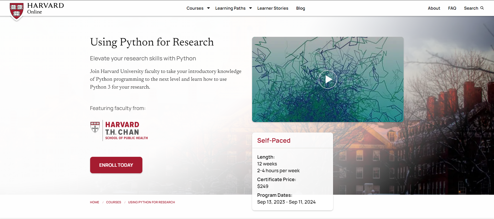
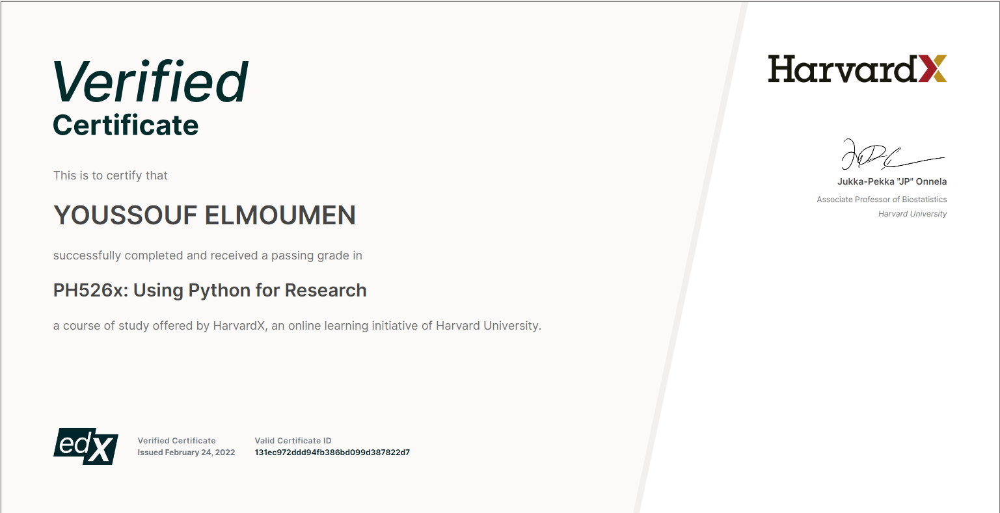

# HarvardX Using Python for Research Certification

## About this Course

This repository documents my successful completion of the HarvardX course "Using Python for Research." The course bridges the gap between introductory and advanced Python courses, providing a deep understanding of Python's application in research projects.

### What I Learned

- Python 3 programming basics (review)
- Python tools for research applications (e.g., NumPy and SciPy modules)
- Application of Python research tools in practical settings

### Syllabus

- **Week 1: Python Basics**
  - Review of basic Python 3 language concepts and syntax.

- **Week 2: Python Research Tools**
  - Introduction to Python modules commonly used in scientific computation, such as NumPy.

- **Weeks 3 & 4: Case Studies**
  - A collection of six case studies from different disciplines provides opportunities to practice Python research skills.

- **Week 5: Statistical Learning**
  - Exploration of statistical learning using the scikit-learn library followed by a two-part case study for further practice.

## Certification

I successfully completed the course and earned the ["Using Python for Research"](https://courses.edx.org/certificates/131ec972ddd94fb386bd099d387822d7) certification.

  

## About the Instructors

### Jukka-Pekka "JP" Onnela
- Associate Professor of Biostatistics
- Harvard University

---

*Note: The course content and structure are based on information available as of my completion date. For the most up-to-date information, please refer to the official course materials provided by HarvardX.*
